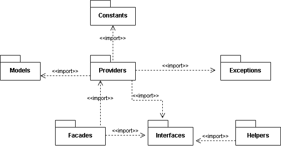

# Package Diagram

The modules (or packages) of the library are:

- `Interfaces`: Here are all the interfaces that the consumer will be able to use.
- `Providers`: Here are all the classes that implement the interfaces.
- `Exceptions`: Here are all the classes that represent the exceptions that can occur when using the library methods.
- `Helpers`: Here are all the classes that help the client, these class do not have much to do with the purpose of the library but serve as an extra help for the client.
- `Constants`: Here are all the classes that store constant values.
- `Models`: Here are all the domain classes. The domain class are those that are taken depending on the problem to be solved, in this case, the problem that this library solves is to be able to read the data of the sections of a file, so a domain class is `SectionModel` (with attributes as `Name` and `Data`).
- `Facades`: Here are all the facade classes, these classes only hide the implementation details, as they do not actually perform the task, but delegate that task to other classes.

[Click here](https://drive.google.com/file/d/1t7eEpelY4lr6WpC3hdU3gbiItpXZGVub/view?usp=sharing)
